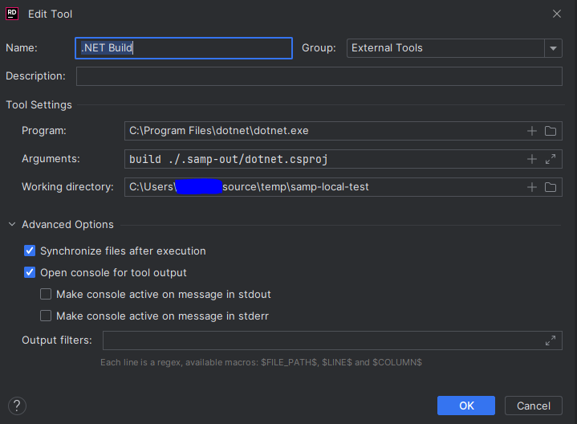

Prerequisites at time of writing:
* Function runtime should be `dotnet6`
* Has to be a SAM project. CDK might come later
* It assumes a folder structure where the SAM template is in the root, next to the `samconfig.toml` file
* The SAM template can be in either JSON or YAML format and can be called anything with a `json`, `yml`, `yaml` or `.template` extension
* You need to have npm/node isntalled on your system

### Instructions for VS Code
1. Clone this repo and check out this branch (`dotnet-support`)
2. Run `npm link`
3. cd to your .NET Lambda project root (make sure it has been deployed and that you're targeting a test environment)
4. Create `.vscode/launch.json` and `.vscode/tasks.json` files (see below). Should work for any IDE, but have only tried in vscode. Creation of these will be automated in the future.
5. Run `samp local --profile <your aws profile>` and leave it running. (see `samp local --help` for all options)
6. Hit F5 (or start debugging via the dropdown menu)

`.vscode/launch.json`:
```
{
  "version": "0.2.0",
  "configurations": [
    {
      "name": "Debug Lambda functions",
      "type": "coreclr",
      "request": "launch",
      "preLaunchTask": "build",      
      "program": "${workspaceFolder}/.samp-out/bin/Debug/net6.0/dotnet.dll",
      "args": [],
      "cwd": "${workspaceFolder}",
      "stopAtEntry": false,
      "console": "internalConsole"
    }
  ]
}
```

`.vscode/tasks.json`:
```
{
  "tasks": [
    {
      "label": "build",
      "command": "dotnet",
      "type": "process",
      "args": [
        "build",
        "${workspaceFolder}/.samp-out/dotnet.csproj"
      ],
      "problemMatcher": "$msCompile"
    },
  ]
}
```

When you're done debugging, exit the `samp local` process with Ctrl+C and you functions will be restored to run in the cloud again.

### Instructions for JetBrains Rider

1. Clone this repo and check out this branch (`dotnet-support`)
2. Run `npm link`
3. Open your solution file in Rider. Ensure the solution file is in the same folder as the SAM template
4. Select Run->Edit Configurations
5. Push the `+` button to add a configuration and select `.NET Executable`
6. Set the `Exe path` to the full path of the samp dotnet.dll file. This will be `/.samp-out/bin/Debug/net6.0/dotnet.dll`. You may see an error that the executable does not yet exist
7. Set the working directory to be the same folder as the SAM template
8. Under the before launch section, add a new `Run External Tool` configuration
9. Add a new tool configuration, this will be used to compile the `/.samp-out/` output
  1. Set the program variable to be the dotnet CLI. Typically this is `C:\ProgramFiles\dotnet\dotnet.exe`
  2. Set the build arguments to be `build ./.samp-out/dotnet.csproj`
  3. Set the working directory to be the same folder as the SAM template
10. You may need to manually build the `.csproj` under `.samp-out/` before Rider will allow you to run the configuration for the first time
11. Run `samp local --profile <your aws profile>` and leave it running. (see `samp local --help` for all options)
12. Hit F5 (or start debugging via the dropdown menu)




### Instructions for Visual Studio

1. Clone this repo and check out this branch (`dotnet-support`)
2. Run `npm link`
4. Run `samp local --profile <your aws profile>` and leave it running. (see `samp local --help` for all options)
5. Add a new folder to your Lambda function project called `Properties`
6. Inside the properties folder, create a file called `launchSettings.json` *this file may already exist*
7. Configure the `launchSettings.json` file to include the below configuration

```json
{
  "profiles": {
    "HelloWorld": {
      "commandName": "Executable",
      "executablePath": "<SAM_TEMPLATE_DIRECTORY>\\.samp-out\\bin\\Debug\\net6.0\\dotnet.exe",
      "workingDirectory": "<SAM_TEMPLATE_DIRECTORY>",
      "remoteDebugEnabled": false
    }
  }
}
```
8. After every change to your function code you need to ensure that the `./.samp-out/dotnet.csproj` file is re-compiled. You can either:
  - Manually recompile using the command line `dotnet build ./samp-out/dotnet.csproj`
  - Add the `dotnet.csproj` file to your solution and recompile as part of your debug process
9. Hit F5 (or start debugging from the UI)